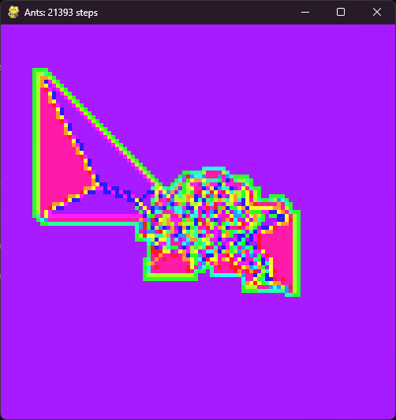

# ants

<br>
langton's ants simulator

# ruleset
- R,L
- T = R2
- K = L2

# controls
- s       to save without current grid state
- g       to save with current grid state
- space   to pause/play
- o       to open a save file
- enter   to step when paused
- r       to show rule and colorlist (new)
- click   to set color of cell, cycling through colorlist (new)
- h       to display controls (new)

<br>
you can also invoke with a filename as an argument to load a save file directly.

<br>
some example saves are included

# save file spec
all params are optional.
if colors specified, ensure number matches ruleset size.
grid items represent color indices.

# future
- multiple ants
- termites

# installation

```python -m pip install -r 'requirements.txt'```

# why
why not
